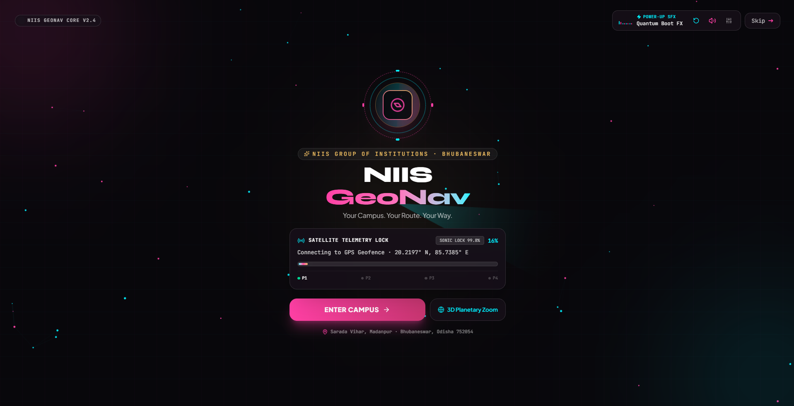
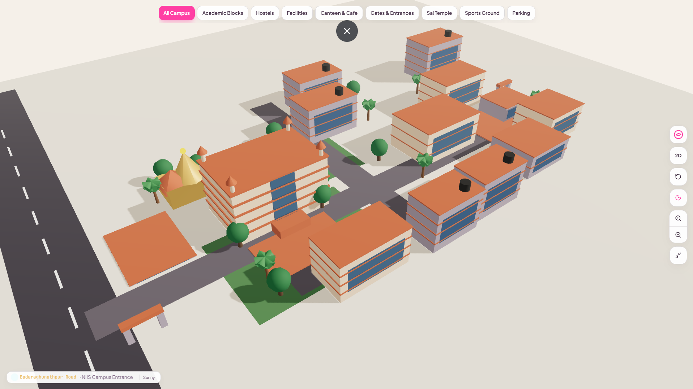
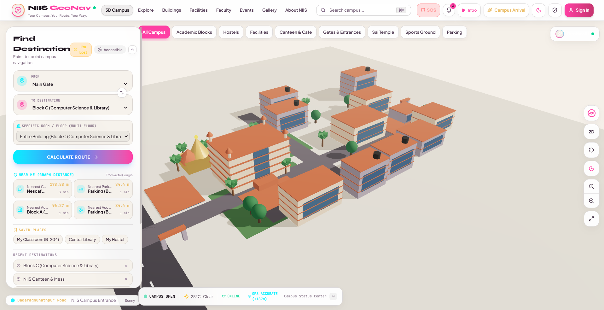
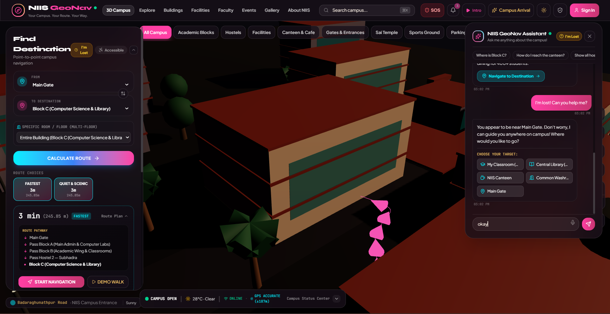
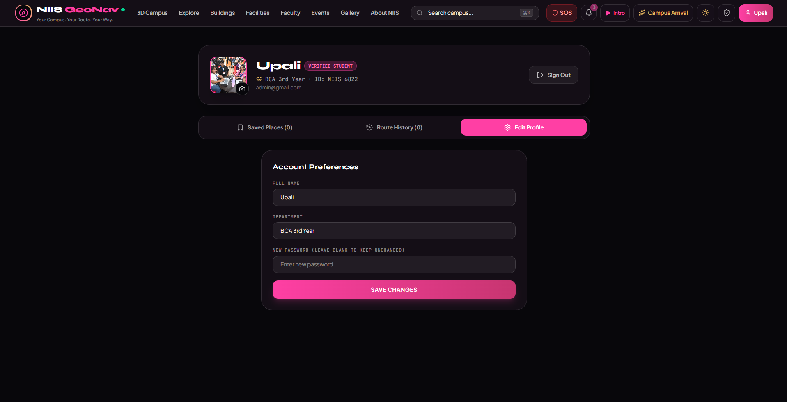

# 🧭 NIIS GeoNav

<div align="center">

### Smart 3D Campus Navigation System

**An intelligent, interactive and context-aware navigation platform designed for NIIS Institute of Information Science & Management.**

<br>

[🌐 Live Demo](https://niis-geonav.onrender.com) •
[💻 GitHub](https://github.com/Upali22/NIIS-GeoNav) •
[🔗 LinkedIn](https://www.linkedin.com/in/upali-aparajita-patra-52915440b/) •
[🌐 Portfolio](https://upali22.github.io/upaliportfolio-html/)

</div>

---

## 📌 Overview

**NIIS GeoNav** is a smart campus navigation platform developed for **NIIS Institute of Information Science & Management**.

The system provides an interactive digital representation of the campus where students, faculty, staff and visitors can discover locations, calculate routes and explore campus facilities through a modern 3D interface.

The platform combines **3D visualization, graph-based navigation, A* pathfinding, AI-assisted interaction, student accounts and administrative data management** into a single campus navigation system.

---

## 🎯 Problem Statement

Navigating a large educational campus can be difficult for new students, visitors, parents and other users who are unfamiliar with the campus layout.

Traditional maps may not provide enough campus-specific information or an immersive understanding of the environment.

**NIIS GeoNav addresses this problem by providing:**

- Interactive campus visualization
- Location-based search
- Distance information
- Intelligent route calculation
- Campus facility information
- AI-assisted assistance
- Administrative campus management

---

# ✨ Key Features

## 🗺️ Smart Campus Navigation

- Search campus buildings and facilities
- Select starting and destination locations
- Calculate route distance
- Display navigation paths
- Find efficient routes between campus locations
- Explore important campus facilities

---

## 🧠 A* Pathfinding

NIIS GeoNav uses the **A\* (A-Star) pathfinding algorithm** for route calculation.

The campus navigation network is represented as a graph where:

- **Nodes** represent campus locations
- **Edges** represent connected paths
- **Weights** represent travel distance/cost

The algorithm evaluates possible routes using:

```text
f(n) = g(n) + h(n)
```

Where:

```text
g(n) → Cost from the starting location
h(n) → Estimated cost to the destination
f(n) → Total estimated cost
```

This allows the system to efficiently search through the campus route network and identify an appropriate route between locations.

---

# 🏫 3D Campus Visualization

The platform provides an interactive **3D representation of the NIIS campus**.

Users can explore the digital campus environment and interact with campus structures through the navigation interface.

The 3D environment is built using:

- Three.js
- React Three Fiber
- React Three Drei

---

# 🚀 Campus Arrival Experience

NIIS GeoNav includes a cinematic campus introduction that establishes the geographical context of the institution.

The experience transitions through:

```text
🌍 Earth
   ↓
🇮🇳 India
   ↓
📍 Odisha
   ↓
🏙️ Bhubaneswar
   ↓
🏫 NIIS Campus
```

This creates an interactive introduction before users enter the main campus navigation environment.

---

# 🤖 NIIS GeoNav AI Assistant

The platform includes an AI-assisted campus interaction interface designed to help users obtain information and interact with the navigation system.

The assistant can be used as an additional interface for discovering campus-related information.

---

# 👤 Student Account System

NIIS GeoNav includes student-oriented account functionality.

### Features

- Student registration
- Login
- Profile information
- Account interface
- Student-specific interaction

---

# 👨‍💼 Admin Portal

The administrative interface provides management functionality for campus information.

Administrators can manage:

- 📢 Announcements
- 👨‍🏫 Core Members / Faculty
- 🖼️ Event Gallery
- 📅 Events
- 🏢 Buildings
- 🧭 Routes
- 🏫 3D Campus information
- 📚 Program-related information

The administrative system allows campus information to be updated without modifying the main navigation interface manually.

---

# 💾 Persistent Data Management

The application includes persistent campus data management so that important administrative changes can remain available after refreshing or reopening the application.

This allows information such as campus content, announcements, faculty information and other managed data to be maintained more reliably than temporary UI state.

---

# 📍 Campus Locations

The current campus navigation system includes important locations such as:

| Category | Locations |
|---|---|
| 🚪 Entrance | Main Gate, Back Gate |
| 🏢 Academic | Block A, Block B, Block C, Block D, Block E |
| 🏠 Hostel | Arnapurna, Subhadra, Jagannath, Balabhadra, Biju Pattanaik |
| 🍴 Food | Nescafe, NIIS Canteen |
| 🌳 Recreation | Open Park, Playground |
| 🛕 Religious | Sai Temple of NIIS |
| 🚻 Facility | Common Washroom |
| 🚗 Transport | Parking |

---

# ⚙️ How NIIS GeoNav Works

```text
              USER
                │
                ▼
        ┌───────────────┐
        │  NIIS GeoNav  │
        │   Interface   │
        └───────┬───────┘
                │
       ┌────────┼────────┐
       │        │        │
       ▼        ▼        ▼
     Search    3D       AI
    Location  Campus  Assistant
       │
       ▼
 Campus Navigation Graph
       │
       ▼
   A* Pathfinding
       │
       ▼
 Route Calculation
       │
       ▼
 Distance + Route
       │
       ▼
 Navigation Display
```

---

# 🏗️ System Architecture

```text
┌───────────────────────────────────────────┐
│                  USER                     │
└─────────────────────┬─────────────────────┘
                      │
                      ▼
┌───────────────────────────────────────────┐
│              React Frontend               │
│                                           │
│  Navigation │ 3D Campus │ AI │ Accounts  │
└─────────────────────┬─────────────────────┘
                      │
          ┌───────────┼───────────┐
          │           │           │
          ▼           ▼           ▼
       Campus       Route       Admin
       Data         Engine      Portal
                      │
                      ▼
                A* Algorithm
                      │
                      ▼
              Navigation Graph
                      │
                      ▼
              Route & Distance
```

---

# 🛠️ Technology Stack

| Technology | Purpose |
|---|---|
| **React** | Frontend interface |
| **TypeScript / JavaScript** | Application logic |
| **Vite** | Development and build tooling |
| **Three.js** | 3D visualization |
| **React Three Fiber** | React-based 3D rendering |
| **React Three Drei** | 3D utilities and components |
| **Framer Motion** | Animations and transitions |
| **Lucide React** | Interface icons |
| **Node.js** | Server-side functionality |
| **A\* Algorithm** | Route/path calculation |
| **Git & GitHub** | Version control and source management |

---

# 📱 Responsive Interface

NIIS GeoNav is designed to adapt to different screen sizes.

Supported interfaces include:

- 💻 Desktop
- 📱 Mobile
- 🖥️ Large displays

The interface also includes:

- 🌙 Dark Mode
- ☀️ Light Mode
- Responsive navigation
- Interactive controls
- Animated UI elements

---

# 📸 Screenshots

> Add your project screenshots inside `docs/screenshots/`.

### 🏠 Landing / Campus Arrival



### 🏫 3D Campus



### 🧭 Navigation



### 🤖 AI Assistant



### 👨‍💼 Admin Portal



### 👤 Student Profile


---

# 🎥 Project Demo

A short demonstration video can be added here to showcase the complete navigation workflow.

**Demo flow:**

```text
Campus Arrival
      ↓
Explore 3D Campus
      ↓
Search Location
      ↓
Select Destination
      ↓
Calculate Route
      ↓
Display Distance
      ↓
Navigate Campus
```

---

# 📂 Project Structure

```text
NIIS-GeoNav/
│
├── public/
│
├── src/
│   ├── components/
│   │   ├── 3d/
│   │   ├── account/
│   │   ├── admin/
│   │   └── ...
│   │
│   ├── services/
│   ├── data/
│   ├── App.tsx
│   └── ...
│
├── docs/
│   ├── screenshots/
│   │   ├── campus-arrival.png
│   │   ├── 3d-campus.png
│   │   ├── navigation.png
│   │   ├── ai-assistant.png
│   │   ├── admin.png
│   │   └── profile.png
│   │
│   ├── architecture.png
│   └── demo.gif
│
├── server.ts
├── package.json
├── README.md
├── .gitignore
└── ...
```

---

# 🚀 Getting Started

## Prerequisites

Make sure the following are installed:

- Node.js
- npm
- Git

## Clone the Repository

```bash
git clone https://github.com/Upali22/NIIS-GeoNav.git
```

## Navigate to the Project

```bash
cd NIIS-GeoNav
```

## Install Dependencies

```bash
npm install
```

## Start Development Server

```bash
npm run dev
```

The development server will provide a local URL where the application can be accessed.

---

# 🔐 Environment Configuration

If environment variables are required, create a local environment file based on the project's environment configuration.

**Never commit private API keys, passwords or credentials to GitHub.**

Example:

```env
API_KEY=your_api_key_here
```

Add private environment files such as:

```text
.env
.env.local
```

to `.gitignore`.

---

# 🧪 Testing & Validation

The project was tested across key user workflows including:

- Campus loading
- 3D visualization
- Location search
- Route calculation
- Distance display
- Student account interface
- Admin functionality
- Data persistence
- Responsive layouts
- Dark and light themes

---

# ⚠️ Current Limitations

The current implementation has several areas that can be expanded in future versions:

- Real-time GPS positioning is not currently implemented.
- Indoor positioning is not currently available.
- Navigation accuracy depends on the available campus route data.
- Large-scale concurrent usage would require additional infrastructure and backend scaling.
- Real-world navigation conditions such as temporary road closures are not yet dynamically incorporated.

---

# 🔮 Future Scope

Potential future improvements include:

- 📍 Real-time GPS positioning
- 🧭 Indoor navigation
- ♿ Accessibility-aware route selection
- 🚶 Walking-time estimation
- 🎙️ Voice-guided navigation
- 📡 Real-time campus updates
- 🔔 Event-based notifications
- 📊 Navigation analytics
- 📱 Progressive Web App support
- 🌐 Multi-campus support
- 🛰️ Improved real-world map integration

---

# 💡 Technical Highlights

- Graph-based campus navigation
- A* pathfinding implementation
- Interactive 3D campus visualization
- React component-based architecture
- Responsive UI design
- Student authentication interface
- Administrative management system
- Persistent campus data management
- Animated user experience
- Modular component structure
- Campus-specific navigation data

---

# 🧩 Challenges & Solutions

### Challenge — Campus Navigation

**Problem:**  
A conventional map does not provide enough campus-specific context.

**Solution:**  
A dedicated campus navigation graph was created to represent important locations and their connections.

### Challenge — Route Calculation

**Problem:**  
Users need an efficient route between two campus locations.

**Solution:**  
The A* pathfinding algorithm evaluates the navigation graph and calculates an efficient route.

### Challenge — 3D Campus Experience

**Problem:**  
A standard 2D interface provides limited spatial understanding.

**Solution:**  
An interactive 3D campus environment was developed using Three.js and React Three Fiber.

### Challenge — Persistent Information

**Problem:**  
Administrative changes should remain available after refreshing the application.

**Solution:**  
Persistent campus data management was incorporated into the application architecture.

---

# 🌐 Live Application

### NIIS GeoNav

🔗 **https://niis-geonav.onrender.com**

---

# 👩‍💻 Developer

### Upali Aparajita Patra

NIIS GeoNav is an independently developed smart campus navigation project focused on exploring **3D visualization, intelligent navigation, pathfinding algorithms, AI-assisted interaction, responsive interfaces and campus information management**.

**Connect with me:**

- 💻 [GitHub](https://github.com/Upali22)
- 🔗 [LinkedIn](https://www.linkedin.com/in/upali-aparajita-patra-52915440b/)
  
---

# 📄 License

This project is developed for educational and demonstration purposes.
